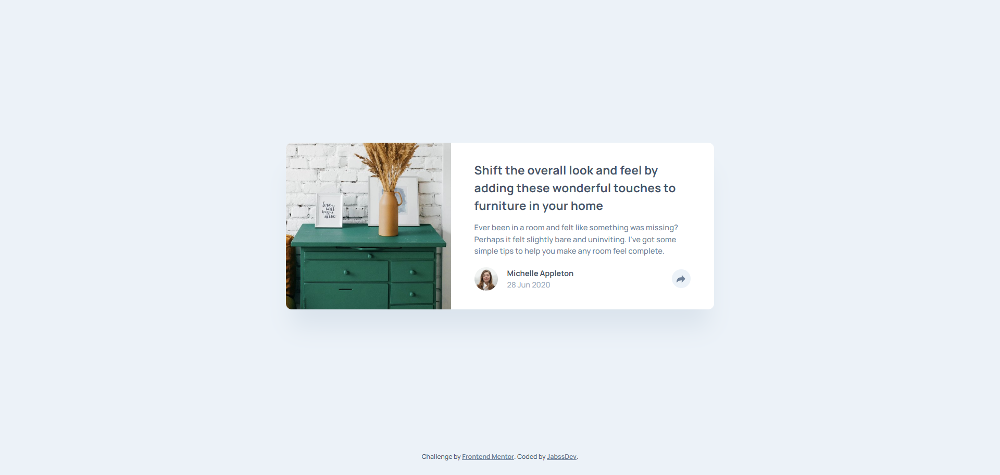

# Article Preview Component - Solution

Esta es una solución al [desafío del componente de vista previa de artículo en Frontend Mentor](https://www.frontendmentor.io/challenges/article-preview-component-dYBN_pYFT).

## Tabla de contenidos

- [Vista General](#vista-general)
  - [El desafío](#el-desafío)
  - [Capturas de pantalla](#capturas-de-pantalla)
  - [Enlaces](#enlaces)
- [Mi proceso](#mi-proceso)
  - [Construido con](#construido-con)
  - [Lo que aprendí](#lo-que-aprendí)
  - [Desarrollo continuo](#desarrollo-continuo)
  - [Recursos útiles](#recursos-utiles)
- [Autor](#autor)

## Vista General

### El desafío

Los usuarios deben ser capaces de:

- Visualizar el diseño óptimo dependiendo del tamaño de pantalla de su dispositivo.
- Ver los enlaces de redes sociales al hacer clic en el botón de compartir.
- Interactuar con el componente de forma accesible mediante teclado.

### Captura de pantalla



### Enlaces

- Live Site URL: [https://jabssdev.github.io/article-preview-component/](https://jabssdev.github.io/article-preview-component/)

## Mi proceso

### Construido con

- **HTML5 Semántico:** Uso de etiquetas como `<article>`, `<header>`, `<main>` y `<time>`.
- **CSS Custom Properties:** Gestión centralizada de colores y tipografía.
- **Flexbox & Grid:** Estructura bidimensional para el diseño responsivo.
- **Mobile-first workflow:** Estrategia de diseño de menor a mayor resolución.
- **JavaScript Moderno (ES6+):** Lógica de estados y accesibilidad.

### Lo que aprendí

#### 1. Accesibilidad (A11Y) Proactiva

Implementar el botón de compartir requirió algo más que un simple clic. Utilicé atributos ARIA para asegurar que los usuarios de lectores de pantalla comprendan el estado del componente:

```html
<button class="article-card__share-trigger" aria-expanded="false" aria-controls="share-menu" aria-label="Toggle share menu">
	<!-- SVG Icon -->
</button>
```

#### 2. Posicionamiento Estratégico (CSS)

El mayor desafío fue el cambio radical del menú de compartir entre dispositivos. En Desktop funciona como un tooltip con flecha, mientras que en Mobile es una barra que se superpone al pie. Lo resolvimos mediante un posicionamiento absoluto inteligente y ajustes sobre el contenedor:

```css
/* Tooltip en escritorio con flecha indicadora */
@media (min-width: 900px) {
	.article-card__share-menu {
		bottom: calc(100% + 2.5rem);
		left: 50%;
		transform: translateX(-50%);
		box-shadow: 0 1.2rem 2.4rem rgba(0, 0, 0, 0.15);
	}
}
```

#### 3. Lógica Robusta y Resiliente

En la parte de JavaScript, prioricé la experiencia de usuario cerrando el menú no solo con el botón, sino también al presionar la tecla `Escape` o al hacer clic fuera del componente:

```js
document.addEventListener("keydown", (e) => {
	if (e.key === "Escape") {
		closeMenu();
		shareBtn.focus();
	}
});
```

### Desarrollo continuo

En futuros proyectos, planeo profundizar en:

- **Animaciones complejas:** Refinar las transiciones del tooltip para que se sientan aún más naturales.
- **Arquitectura CSS avanzada:** Seguir aplicando BEM para mantener especificidad baja y reutilización alta.

### Recursos útiles

- [MDN - ARIA Expanded](https://developer.mozilla.org/en-US/docs/Web/Accessibility/ARIA/Attributes/aria-expanded) - Vital para entender cómo comunicar cambios de estado.
- [A Complete Guide to Flexbox](https://css-tricks.com/snippets/css/a-guide-to-flexbox/) - Documentación de referencia para alinear los elementos internos con precisión.

## Autor

- Frontend Mentor - [@jabssdev](https://www.frontendmentor.io/profile/jabssdev)
- GitHub - [JabssDev](https://github.com/jabssdev)
